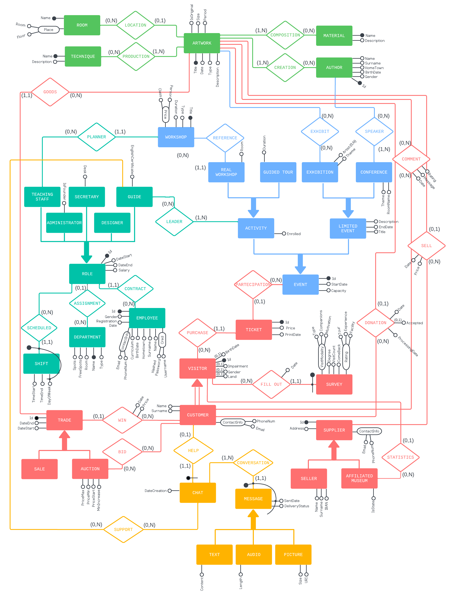
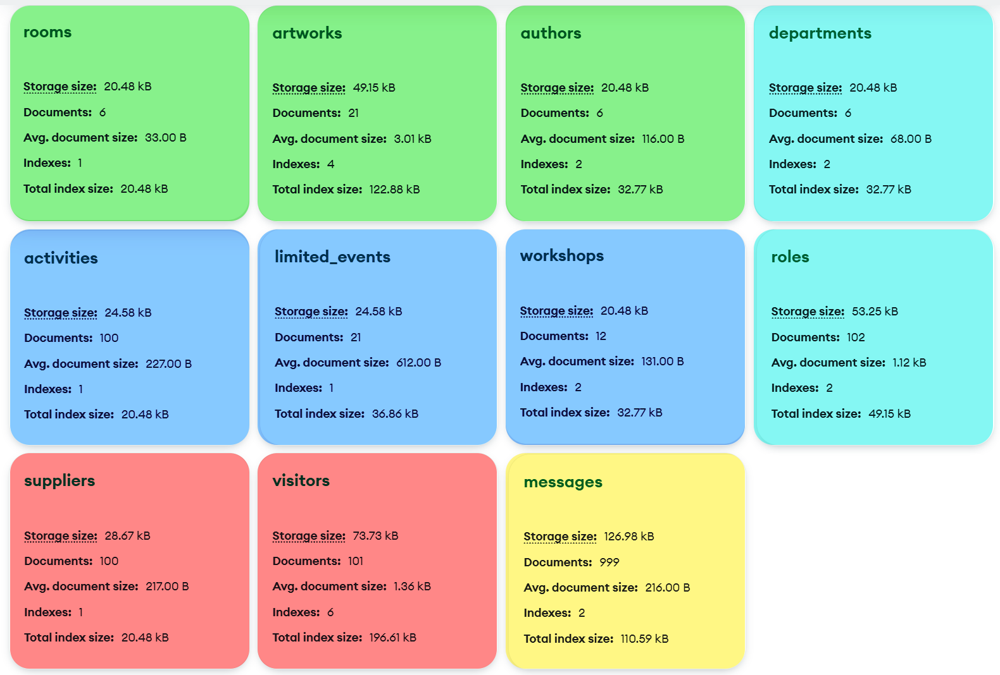

# Omero Museum MongoDB

<p align="center">
  </img>
</p>

This project proposes a redesign and reimplementation using NoSQL of an obsolete relational database for managing the State Omero Museum.

>[!WARNING]
> This project is entirely amateur and educational. It was created without any permission, endorsement, or collaboration from the [State Omero Museum](https://www.museoomero.it/). All content, structure, and data usage are fictional or hypothetical.

<p align="center">
  </img>
</p>

## How to load the database
`mongodump` from [*MongoDB Database Tools*](https://www.mongodb.com/docs/database-tools/) was used to dump the database right after MySQL migration. Therefore, you need to load it using `mongorestore`, available in the same collection of tools.

```sh
mongorestore --host localhost:27017 --db omero_museum  "backup/5_optimized/omero_museum"
```
The snapshot zoo is the following:

| Stage | Snapshot                                                     | Description                                                                                                                                                                                                                                                    |
| :---: | :----------------------------------------------------------- | -------------------------------------------------------------------------------------------------------------------------------------------------------------------------------------------------------------------------------------------------------------- |
|   1   | [`after_migration`](backup/1_after_migration)                | As the database schema has evolved significantly since the current MySQL database was created, we've first migrated a subset of the collections using [_MongoDB Relational Migrator_](https://www.mongodb.com/resources/solutions/use-cases/mysql-to-mongodb). |
|   2   | [`migration_preprocessed`](backup/2_migration_preprocessed/) | The schema is translated from Italian to English and missing collections are added.                                                                                                                                                                            |
|   3   | [`seeded`](backup/3_seeded/)                                 | Complete seeders are defined for each collection not already filled by the MySQL migration. These seeders inevitably violete some inter-documents constraints.                                                                                                 |
|   4   | [`consistent`](backup/4_consistent/)                         | The main broken contraints are enforced to improve the overall consistency.                                                                                                                                                                                    |
|   5   | [`optimized`](backup/5_optimized/)                           | Secondary indexes (B-Trees) are defined on top-entry fields and aggregate identifiers to enable faster retrieval. These indexes are expecially essential for some queries.                                                                                     |

Now you're ready to execute the queries listed in [`2-queries`](2-queries/).

## Activities Flowchart
<p align="center">
  </img>
</p>

## Entity-Relationship Diagram
<p align="center">
  </img>
</p>

## Logical schema
<p align="center">
  </img>
</p>